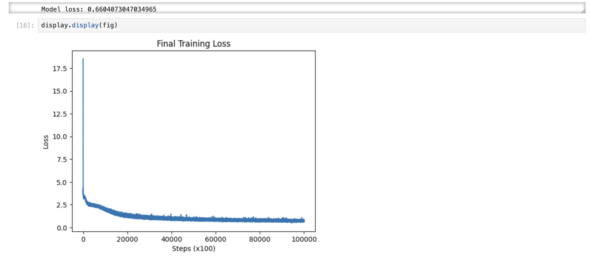
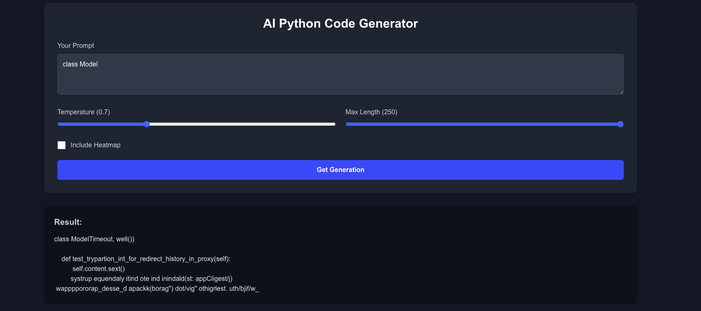
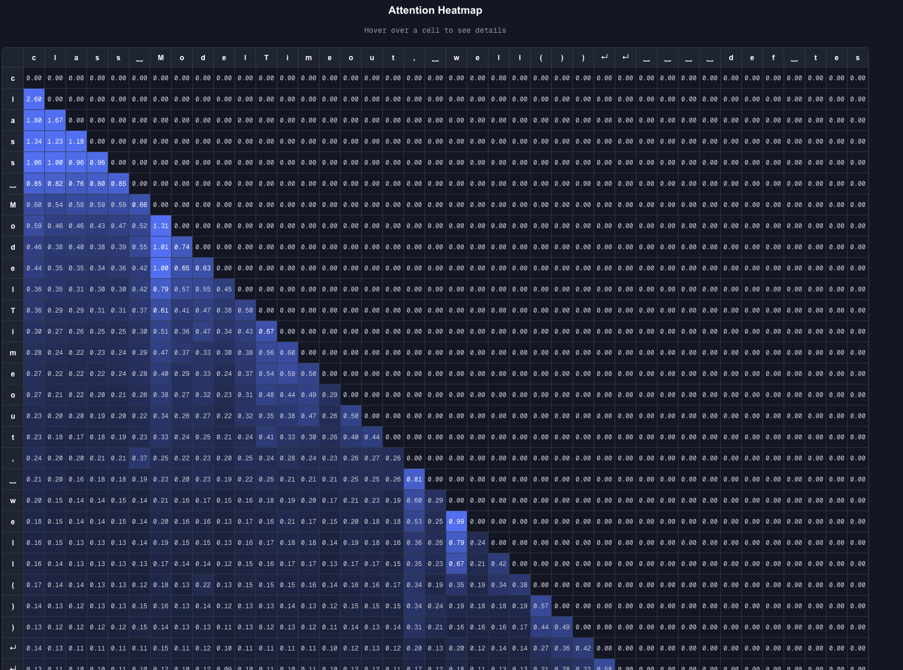
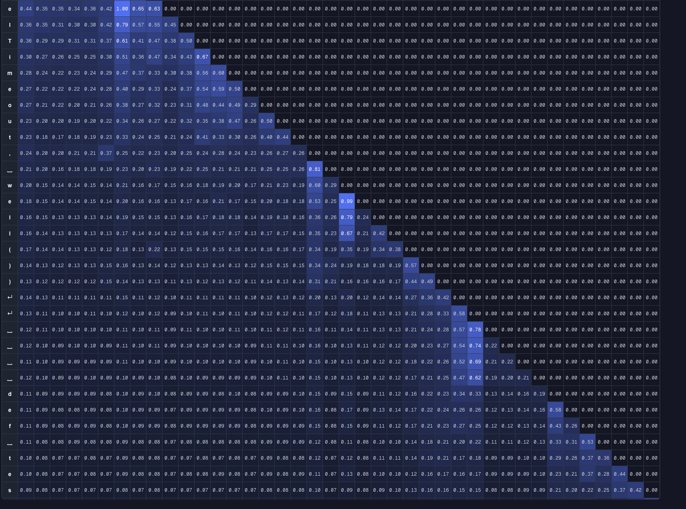

## Description
In this project I created a LLM (Large Language Model) from scratch, without the aid of libraries such as PyTorch or TensorFlow. Taking on such a challenges is important to my personal development as it allows me to understand LLM's in a practical, encompassing manner, in all of it's complexity which modern libraries often take away. While getting the basic structure of the LLM was the most important task, this project allowed me to implement advanced methods such as LoRA (Low-rank Adaptation), and learning decay (cosine, linear). 

## Model structure
While my model doesn't rely on libraries to take on the complexity of modern LLM logic, I was still able to implement a state of the art structure in my code, particularily the self-attention head. Outlined in Google's famous paper "Attention is all you need" (2017), self-attention is arguable the most important breakthrough in modern machine learning. I was able to succesfully implement a multi-headed self attention structure, where each transformer had 8 self attention heads. Along with this, each transformer had a simple hidden layer with non-linear activation (ReLU). Finally, I implemented used 2 LayerNorms and a residual connection step in each transformer logic to supplement my attention based training. Using 6 of these transformers in my model's training, along with the embedding and positional matrices, makes up my from-scratch LLM.

## Training 
Here's the training schedule of my base model. This took over 24 hours!

This model achieved a cross entropy loss of 0.6. While this doesnt translate directly into accuracy, we can estimate by taking e^-0.6,
which is roughly 54.9%. 

## Model Interface
Being a front end devloper, leaving the model as just a notebook didn't feel right. I decided to make a Next.JS app where any user could prompt the model, adjust it's temperature and generation length, and see it's attention "heatmap". Implemented this was fairly simple, and HuggingFace worked amazingly as a deployment container for my heavy model logic. This gave me space to focus on the UI; check out some of the photos below:






## Hugging Face Repository
https://huggingface.co/spaces/kalandjl/leanai-gradio/tree/main

## How to use it 
First of all, clone the git repo:
```
git clone https://www.github.com/kalandjl/llm-from-scratch
```

### Notebooks
My main training logic was implemented in model.ipynb, where the base model was trained and exported. However, I would recommend you use the lora.ipynb, which as it preloads the weights from the /models directory. If you don't want to use the lora implementation, just remove the cell which replaces my original W_query and W_value layers with LoRALayer. To use any of the notebooks, ensure jupyter is installed, and run 
```
jupyter notebook
```
### Front end
To use my front end environement, first enter the working directory and install deps
```
cd client
npm install
```
Then, start the Next.JS server
```
npm run dev
```
